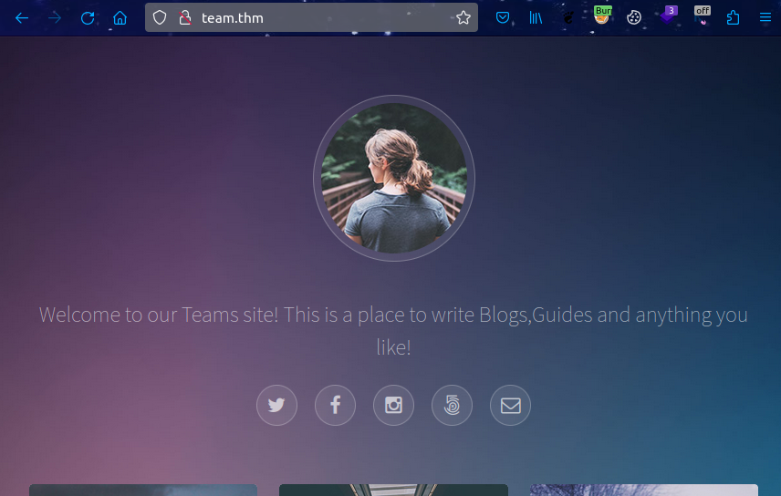
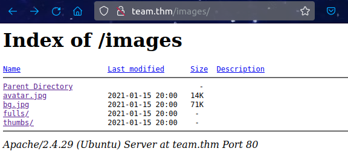
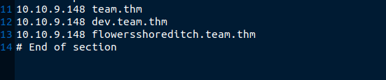
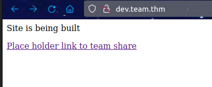

# Team (THM)

- https://tryhackme.com/room/teamcw
- March 8, 2023
- easy

---

## Enumeration

### Nmap

1. 21/ftp vsftpd 3.0.3
2. 22/ssh OpenSSH 7.6p1 Ubuntu 4ubuntu0.3 (Ubuntu Linux; protocol 2.0)
3. 80/http Apache httpd 2.4.29 ((Ubuntu))
   - Apache Default Page

### FTP

- anonymous login not allowed

### HTTP

- it is just a default page
- directory brute forcing with ffuf
- nothing found
- I was confused and glimpse a writeup
- it needs to add `team.thm` in `/etc/hosts/` file of our local machine
- after this, a webpage can be found



- directory brute forcing with ffuf

```
assets -> 403
scripts -> 403
images
index.html
robots.txt -> dale
```



- nothing special found
- with ffuf, find other subdomains

```sh
$ ffuf -u http://team.thm -w /usr/share/wordlists/dnsnames.txt -H "Host: FUZZ.team.thm" -c -t 128 -fs 11366
```

```
dev
flowersshoreditch
```

- add these two to `/etc/hosts` file



- `dev.team.thm`



## User Access

## Root Access
