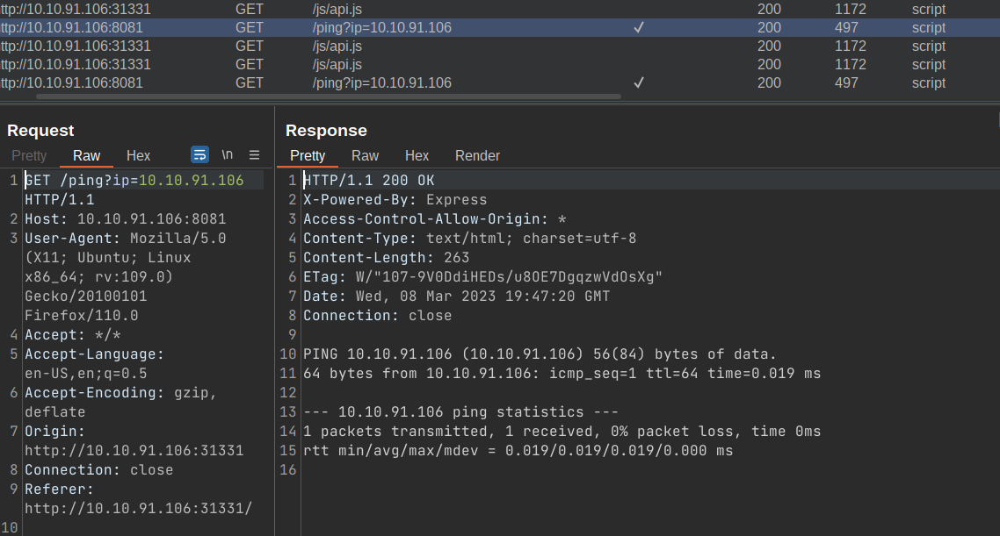
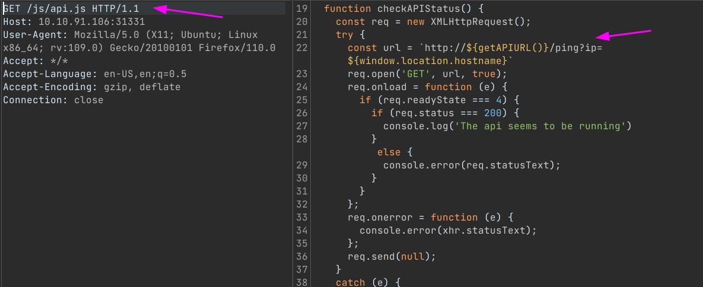
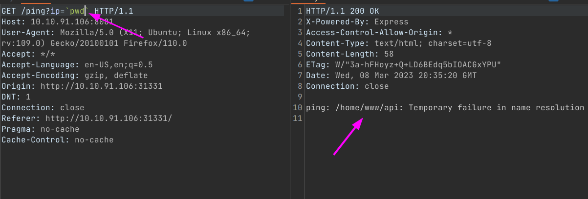
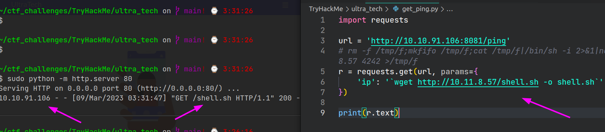
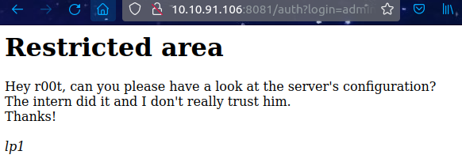

# UltraTech (THM)

- https://tryhackme.com/room/ultratech1
- March 9, 2023
- medium

---

## Enumeration

### Nmap

1. 21/ftp vsftpd 3.0.3
   - no anonymous login allowed
2. 22/ssh OpenSSH 7.6p1 Ubuntu 4ubuntu0.3 (Ubuntu Linux; protocol 2.0)
3. 42/tcp nameserver
4. 3404/tcp unknown
5. 8081/http Node.js Express framework
6. 9876/tcp sd

- run rustscan found `31331/tcp unknown`
- `nmap -A` to this port

7. 31331/http Apache httpd 2.4.29 ((Ubuntu))

### HTTP/8081

- it is a Node JS Server
- nothing show in home page, just `UltraTech API v0.1.3`
- directory brute forcing with ffuf
- found `auth`
- http://$IP:8081/auth - `You must specify a login and a password`

### HTTP/31331

- i think main site is here


- robots.txt -> `Sitemap: /utech_sitemap.txt`
- utech_sitemap.txt ->

```
/index.html
/what.html
/partners.html
```

- found one interesting



- ping from 31331 to 8081 ??

- it is ping by this script



- directory brute forcing at 31331
- found `css, images, javascript, js`
- after figuring out a little bit, I found connection between these two ports.
- if I submit at `http://$IP:31331/partners.html`, it calls the `http://$IP:8081/auth?login=somename&password=pwd` like this
- when I request the `http://$IP:31331/partners.html`, it calls the `http://$IP:8081/ping?ip=$IP`

- I thought this ping parameter will execute like this in the backend -> `ping parameter_value_from_ip`
- so, I tested in my terminal how can I inject like that situation
- `ping try_some_command_here`
- by using backtick, it will execute



- so, we can do remote code exection
- try to get with reverse shell commands, but not success
- tried also like this, but not success



- I follow the questions from THM
- by injecting with ip=`ls` and found database name
- use cat command to that database and found 2 users and password hashes
- crack that hash and get the user's passwords



## User Access

- try to enter ssh with above credentials

```sh
r00t@ultratech-prod:~$ sudo -l
[sudo] password for r00t:
Sorry, user r00t may not run sudo on ultratech-prod.

r00t@ultratech-prod:~$ id
uid=1001(r00t) gid=1001(r00t) groups=1001(r00t),116(docker)
```

- user can run docker.

## Root Access

- run this command to get root access

```
docker run -v /:/mnt --rm -it bash chroot /mnt sh
```

---
