# VulnNet: Internal (THM)

- https://tryhackme.com/room/vulnnetinternal
- March 14, 2023
- easy

---

## Enumeration

### Nmap

- all ports

```
PORT      STATE SERVICE      REASON     VERSION
22/tcp    open  ssh          syn-ack    OpenSSH 7.6p1 Ubuntu 4ubuntu0.3 (Ubuntu Linux; protocol 2.0)
111/tcp   open  rpcbind      syn-ack
139/tcp   open  netbios-ssn  syn-ack    Samba smbd 3.X - 4.X
445/tcp   open  microsoft-ds syn-ack    Samba smbd 3.X - 4.X
873/tcp   open  rsync        syn-ack
2049/tcp  open  nfs          syn-ack
6379/tcp  open  redis        syn-ack
9090/tcp filter zeus-admin  no-response
33455/tcp open  unknown      syn-ack
36059/tcp open  unknown      syn-ack
37721/tcp open  unknown      syn-ack
46937/tcp open  unknown      syn-ack
```

### SMB

- check with smbmap

```
Disk    Permissions	Comment
----    -----------	-------
print$  NO ACCESS	Printer Drivers
shares  READ ONLY	VulnNet Business Shares
IPC$    NO ACCESS	IPC Service (vulnnet-internal server (Samba, Ubuntu))
```
- can enter `shares` without password

```
$ smbclient //$IP/shares
```
- two directories -> in one directory, one flag can be found

### NFS

```sh
showmount -e $IP
# /opt/conf *
mkdir /tmp/m
sudo mount $IP:/opt/conf /tmp/m
```
- check its content
- from redis folder, found redis.conf file
- grep `pass` keywords and found password

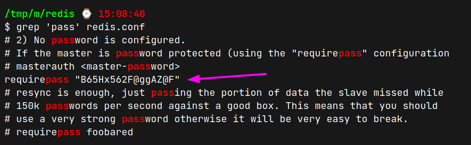

### REDIS

- redis server is open at port 6379 which is default port
- to connect with redis server, `redis-cli` needs to be installed on the local machine
- easy way to install is 

```sh
sudo apt install redis-tools
```
- enter redis server with above password

```sh
redis-cli -h $IP -a password_here
```

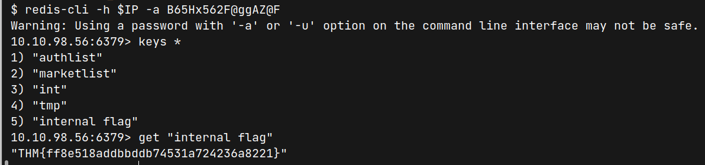

- get next flag
- check the authlist

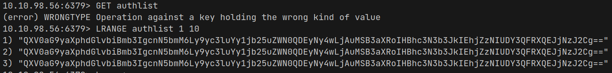

- decrypt base64 and it links to rsync service with password

```
Authorization for rsync://rsync-connect@127.0.0.1 with password Hcg3HP67@TW@Bc72v
```

### RSYNC

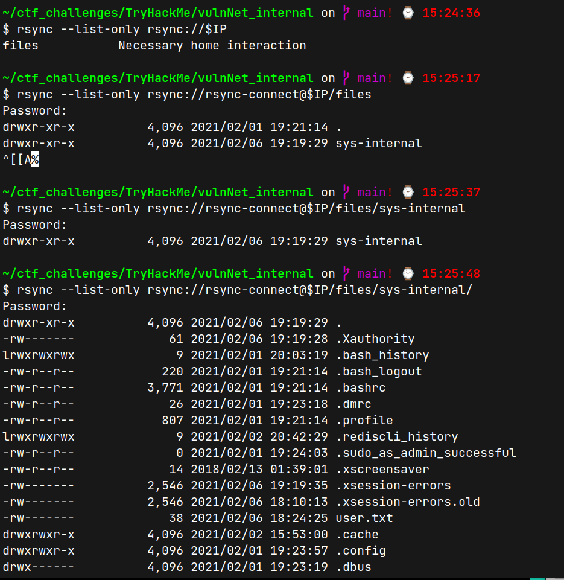

- for me, it is the first time to connect with rsync service and don't know exactly what they mean
- found .ssh folder under `/files/sys-internal/` directory
- create ssh id_rsa key pairs in local machine and copy the `id_rsa.pub` file as `authorized_keys` under `.ssh` folder in remote machine

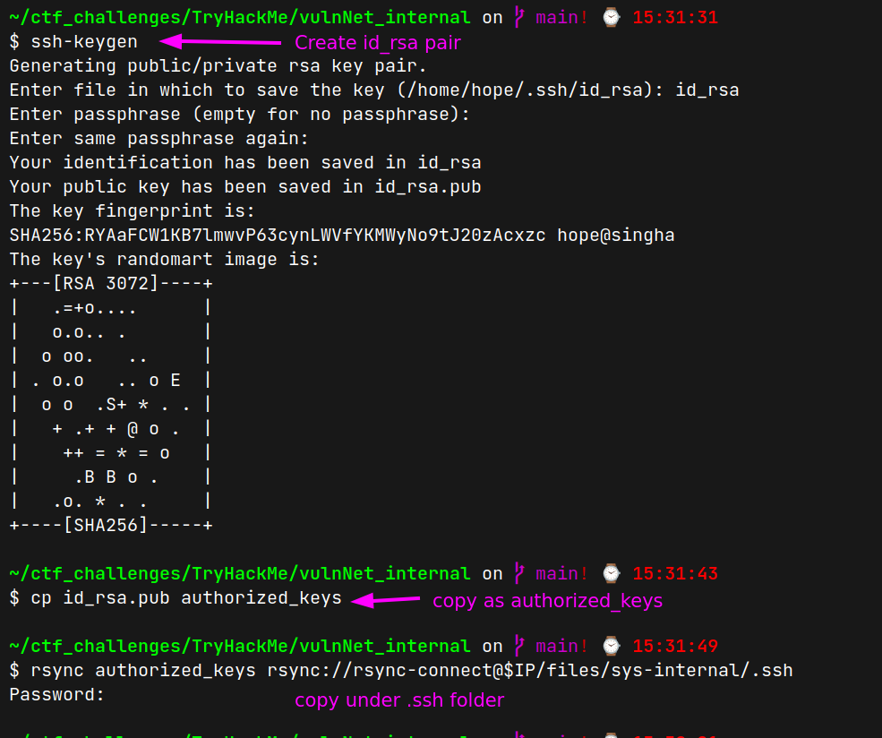


## User Access

- now can enter ssh with id_rsa 
- username may be sys-internal

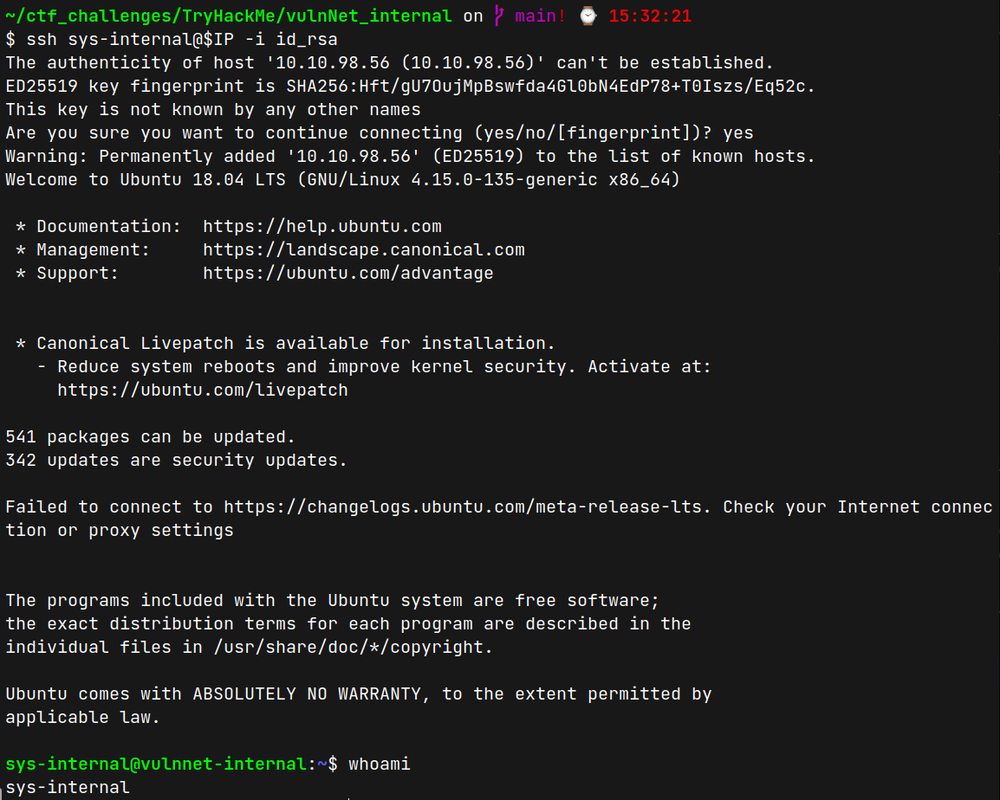

- get `sys-internal` user access
- check `sudo -l` but don't know the password
- check suid bits -> nothing interesting found
- check `capabilities` -> nothing special found
- check running services -> some services are running

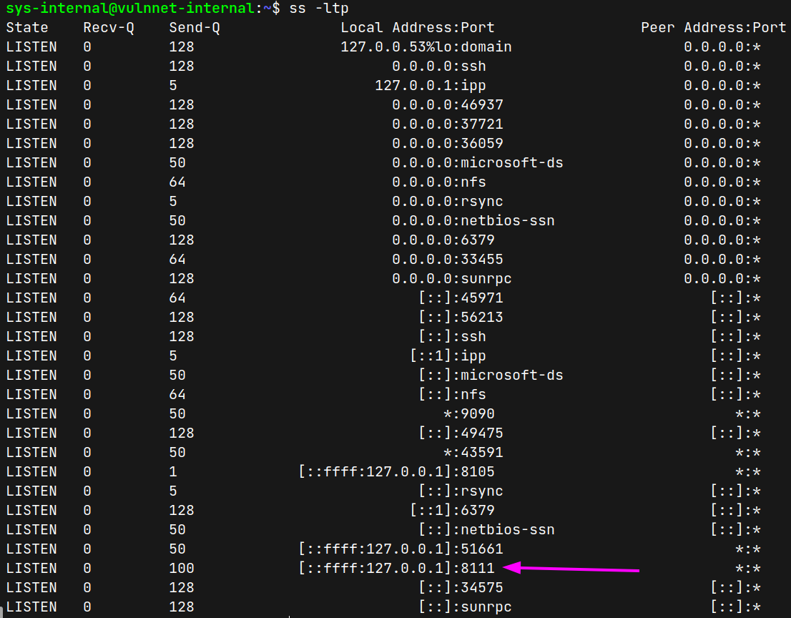

- it is a web service
  
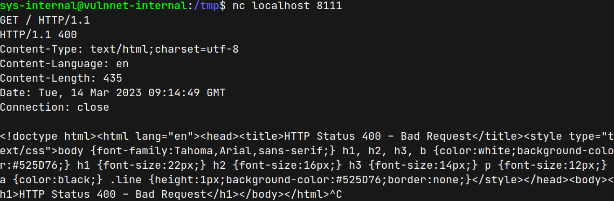

- then use ssh portforwarding to be open in the browser

```sh
ssh -L 8111:127.0.0.1:8111 sys-internal@$IP -i id_rsa
```
- then we can open at our localhost:8111
  
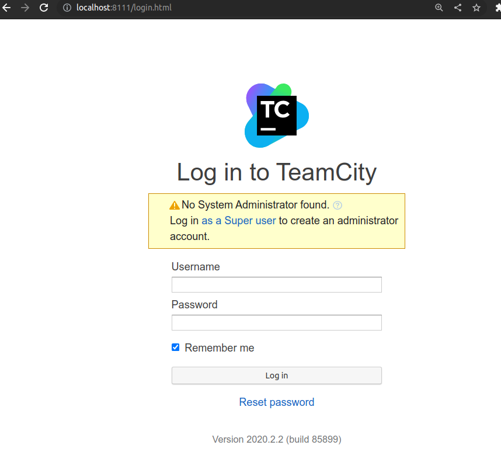

- it is login page and try to enter with guessing or above credentials but not success
- there is a link to login as superuser
- it needs only token 

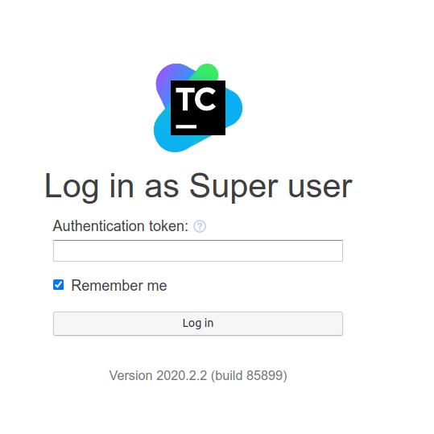

- enter with random token and analyse which parameters are working 

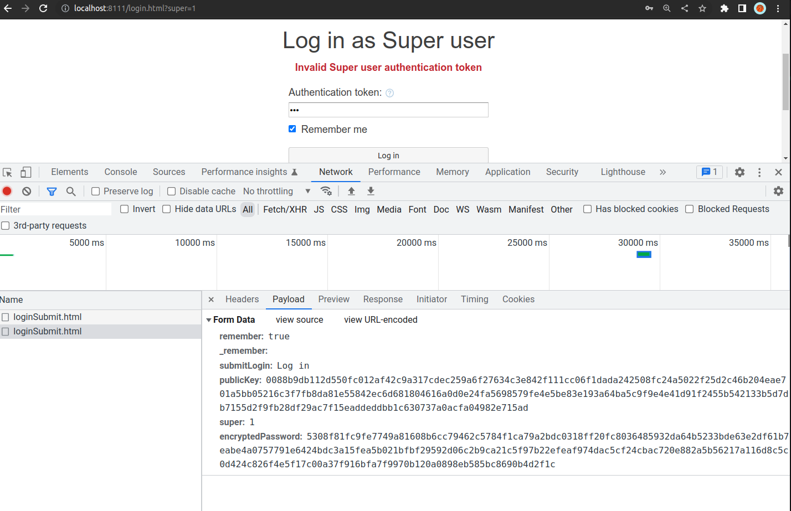

- can I find previous login token in log files as we have ssh access ??
- before this, I run linpeas and found `TeamCity` folder in the `/` directory
- I found logs folder at `/TeamCity/logs`
- find with superuser keyword

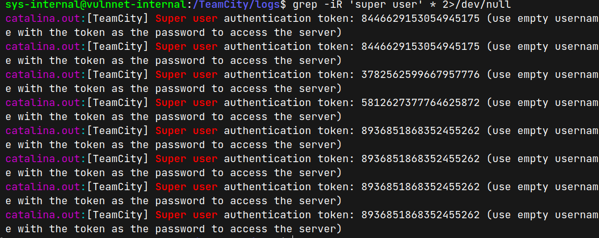

- among them, one token works and redirect to a new page

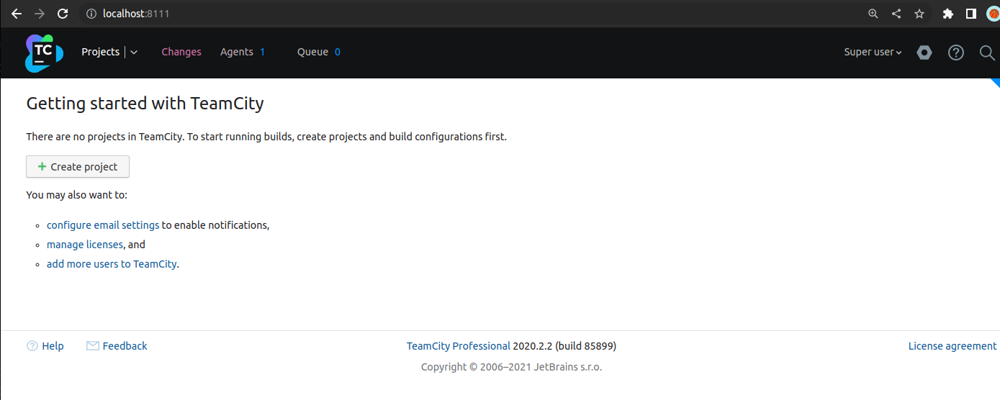


## Root Access
