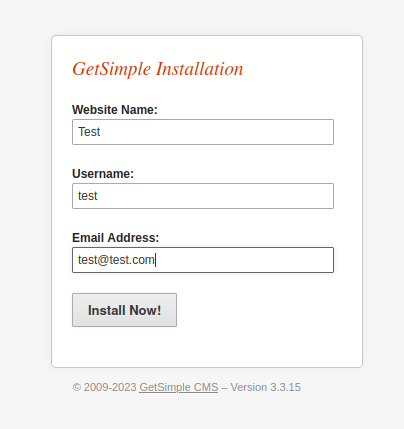
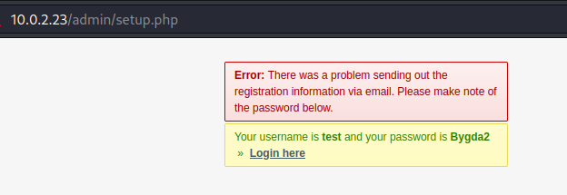
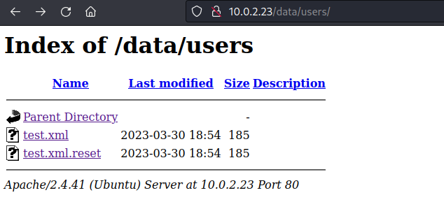
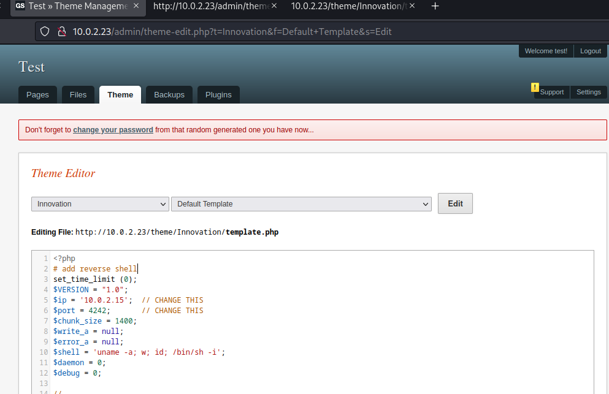
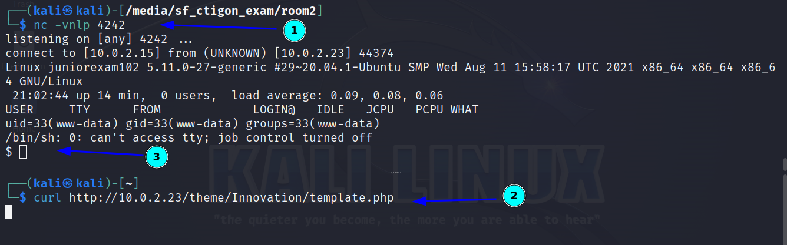
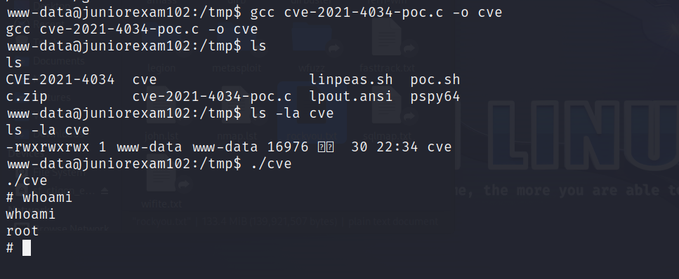

# Creatigon Basic Pentest Exam (2)

- March 30, 2022, 6:23 pm
- Singha


---

## Summary

- get `www-data` user access via `reverse shell file-upload`
- get `root` access via `CVE-2021-4034`

## Enumeration

### Nmap

```
PORT   STATE SERVICE REASON  VERSION
21/tcp open  ftp     syn-ack vsftpd 3.0.3
22/tcp open  ssh     syn-ack OpenSSH 8.2p1 Ubuntu 4ubuntu0.5 (Ubuntu Linux; protocol 2.0)
80/tcp open  http    syn-ack Apache httpd 2.4.41 ((Ubuntu))
| http-robots.txt: 1 disallowed entry 
|_/admin/
```

- ftp - anonymous login not allowed

### HTTP

- robots.txt -> `/admin`
- redirect to `install.php` page


- exploit detail found here
- https://ssd-disclosure.com/ssd-advisory-getcms-unauthenticated-remote-code-execution/
- in this exploit, need to create user as there is no user in this website and have access to create a user

- install



- redirect to 



- can find `test` user



- go to `http://$IP/admin/theme-edit.php` and click `Edit`
- add reverse shell to this theme-edit.php file and saved



## User Access

- listen with nc and send get request to this url and get www-data user access



- run linpeas and found that it is vulnerable to `CVE-2021-4034` and found this repo that get root access
- https://github.com/arthepsy/CVE-2021-4034/blob/main/cve-2021-4034-poc.c


## Root Access

- compile and run this exploit and get root access




